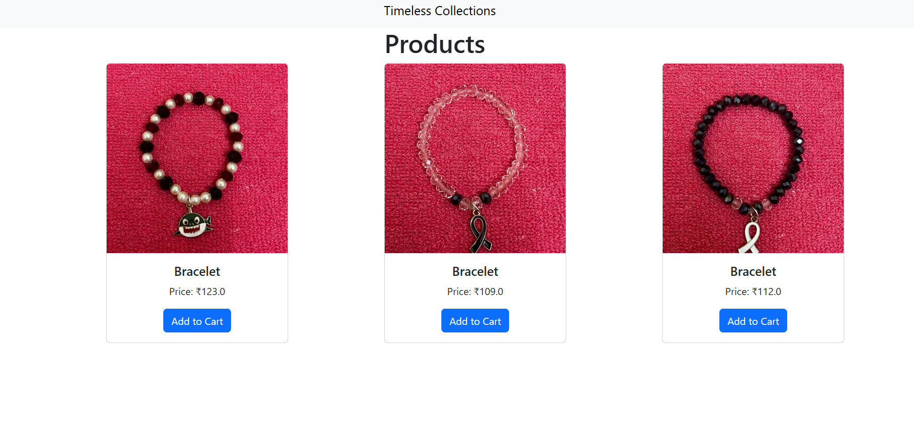

# **PyShop: A Django-based Product Management System**

## **Overview**

**PyShop** is a simple web application built with Django that allows users to manage products in an online store. It features an **Admin Panel** for managing products and offers, and a **Product Listing Page** to display products.

## **Features:**
- **Product Management**: Add, view, and manage products.
- **Admin Panel**: Manage products and offers easily.
- **Offers Management**: Add discounts and promotional offers.

## **Technologies Used:**
- **Django**
- **Python**
- **SQLite**
- **HTML/CSS**

## **Setup Instructions**
**Clone the repository:**

git clone https://github.com/Harish-1910/PyShop.git

cd PyShop

**Create a virtual environment:**

 python -m venv .venv

**Activate the virtual environment:**

On Windows:
.venv\Scripts\activate

On macOS/Linux:
source .venv/bin/activate

**Install required packages:**
pip install -r requirements.txt

**Apply migrations:**
python manage.py migrate

**Create a superuser:**
python manage.py createsuperuser

**Run the development server:**
python manage.py runserver

## **Open the application:**

Product listings: http://127.0.0.1:8000/products/

Admin panel: http://127.0.0.1:8000/admin/

## 📸 Screenshots

### 🛡️ Admin Panel

### 🛒 Product Page

##**License**
This project is licensed under the MIT License.

## 🛠️ Built With

